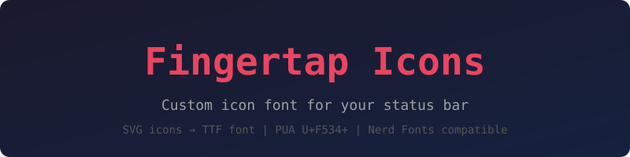
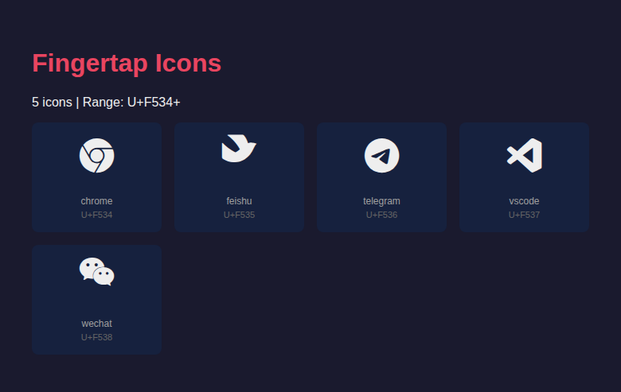

<p align="center">
  
</p>

<p align="center">
  Custom icon font for your status bar. Nerd Fonts compatible.
</p>

---

## Screenshot

<p align="center">
  
</p>

## Quick Start

```bash
# 1. Put SVG icons in icons/svg/
#    (Recommend: download monochrome SVGs from https://simpleicons.org)
mkdir -p icons/svg
# Example:
curl -o icons/svg/telegram.svg https://cdn.jsdelivr.net/npm/simple-icons@latest/icons/telegram.svg

# 2. Build & install
make install
```

Or step by step:

```bash
make          # build font
make install  # build + install to ~/.local/share/fonts/
make clean    # remove generated files
make uninstall
```

## Input Requirements

Place SVG files in `icons/svg/`. File naming rules:

- Lowercase alphanumeric + hyphens: `feishu.svg`, `my-app.svg`
- Monochrome, single-color SVGs work best
- Any viewBox size is fine — the build script auto-scales to fit

PNG fallback: place PNGs in `icons/png/`. They will be auto-vectorized via potrace for icons without a corresponding SVG. Note: this only works well for simple silhouette shapes, not colorful logos.

## Output

After `make`:

- `dist/fingertap-icons.ttf` — the font file
- `dist/codepoints.json` — name to Unicode mapping
- `dist/cheatsheet.txt` — copyable character reference
- `dist/preview.html` — browser preview page

## Codepoint Range

U+F534 onwards (BMP Private Use Area). Does not conflict with Nerd Fonts, Powerline, Font Awesome, Devicons, Codicons, or Octicons.

## Dependencies

- `fontforge` with Python bindings (`apt install fontforge python3-fontforge`)
- `potrace` (`apt install potrace`) — only needed for PNG vectorization
- `imagemagick` (`apt install imagemagick`) — only needed for PNG vectorization

## License

[MIT](LICENSE)
