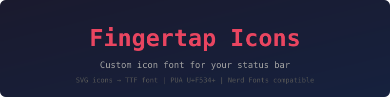
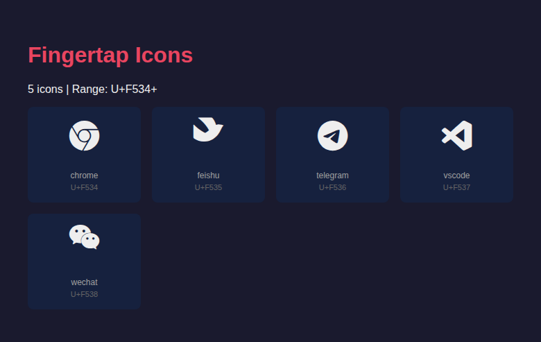

<p align="center">
  
</p>

<p align="center">
  Custom icon font for your status bar. Nerd Fonts compatible.
</p>

---

## Screenshot

<p align="center">
  
</p>

## Quick Start

```bash
# 1. Put SVG icons in icons/svg/
#    (Recommend: download monochrome SVGs from https://simpleicons.org)
mkdir -p icons/svg
# Example:
curl -o icons/svg/telegram.svg https://cdn.jsdelivr.net/npm/simple-icons@latest/icons/telegram.svg

# 2. Build & install
make install
```

Or step by step:

```bash
make          # build font
make install  # build + install to ~/.local/share/fonts/
make clean    # remove generated files
make uninstall
```

## Input Requirements

Place SVG files in `icons/svg/`. File naming rules:

- Lowercase alphanumeric + hyphens: `feishu.svg`, `my-app.svg`
- Monochrome, single-color SVGs work best
- Any viewBox size is fine — the build script auto-scales to fit

PNG fallback: place PNGs in `icons/png/`. They will be auto-vectorized via potrace for icons without a corresponding SVG. Note: this only works well for simple silhouette shapes, not colorful logos.

## Output

After `make`:

- `dist/fingertap-icons.ttf` — the font file
- `dist/codepoints.json` — name to Unicode mapping
- `dist/cheatsheet.txt` — copyable character reference
- `dist/preview.html` — browser preview page

`codepoints.lock.json` in the project root is the source of truth for codepoint
assignment. Commit it. Never reorder or edit existing entries by hand.

## Using the Icons From Configs

`make install` also publishes the mapping to a stable location:

```
~/.local/share/fingertap-icons/codepoints.json
```

Resolve icons **by name** from there rather than pasting the literal character
into your config. Names are permanent; pasted characters silently rot whenever
the icon set changes, and are unreadable in a diff.

Python (e.g. a polybar/waybar script):

```python
import json, os

_MAP = json.load(open(os.path.expanduser(
    "~/.local/share/fingertap-icons/codepoints.json"), encoding="utf-8"))

def ft(name):
    return chr(int(_MAP[name], 16))

ICONS = {"feishu": ft("feishu"), "Blender": ft("blender-1")}
```

Shell:

```bash
FT_MAP=~/.local/share/fingertap-icons/codepoints.json
ft() { printf '%b\n' "\\U$(jq -r --arg n "$1" '.[$n]' "$FT_MAP")"; }

ft feishu   # prints the glyph
```

After adding a new icon, rebuild with `make install` and restart the consumer so
it re-reads the mapping. Existing icons never move, so nothing else needs
touching.

## How It Works

- **Codepoint range**: U+F534 onwards (BMP Private Use Area). Carefully chosen to avoid conflicts with Nerd Fonts, Powerline, Font Awesome, Devicons, Codicons, and Octicons.
- **Stable codepoints**: `codepoints.lock.json` (tracked in git) pins each icon name to a permanent codepoint. An icon keeps its codepoint forever — adding, renaming or deleting icons never shifts the others, so configs that reference these characters stay correct across rebuilds. New icons are appended at the next free codepoint; codepoints of deleted icons are tombstoned and never reassigned.
- **Centroid-based centering**: Icons are positioned using area-weighted centroid (center of mass) computed via the Shoelace formula on glyph contours, rather than simple bounding-box centering. This ensures asymmetric icons like the Feishu bird appear visually balanced.
- **Auto-scaling**: Each icon is scaled to 90% of the em square with uniform padding, regardless of the original SVG viewBox size.

## Dependencies

- `fontforge` with Python bindings (`apt install fontforge python3-fontforge`)
- `potrace` (`apt install potrace`) — only needed for PNG vectorization
- `imagemagick` (`apt install imagemagick`) — only needed for PNG vectorization

## License

[MIT](LICENSE)
